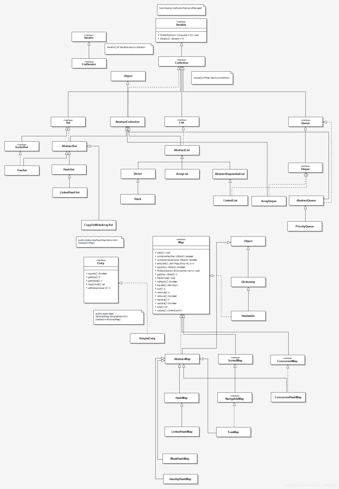
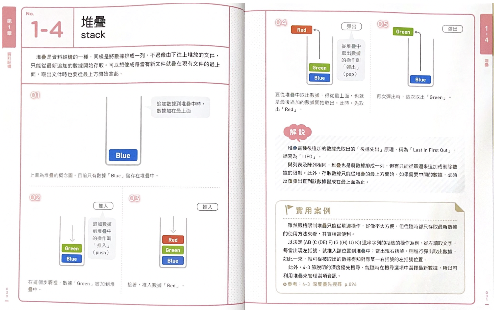
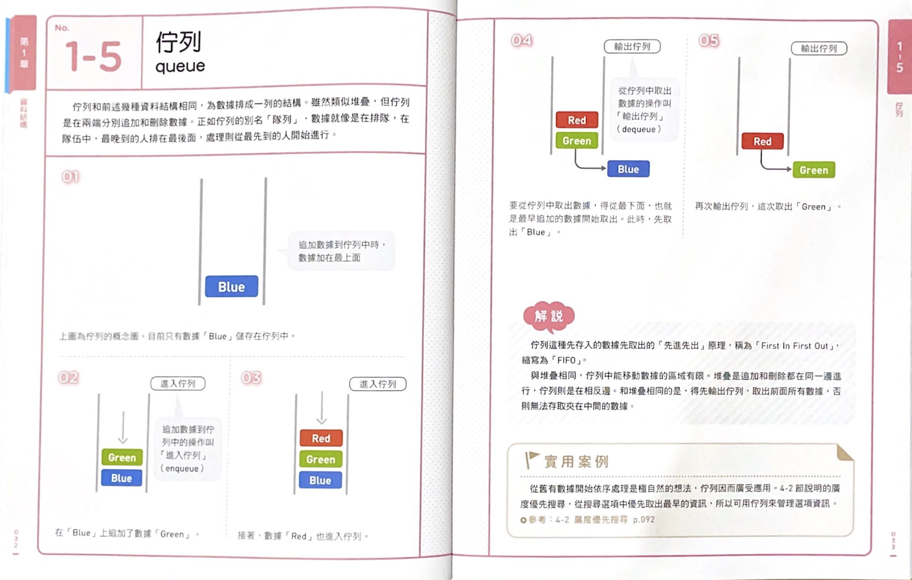
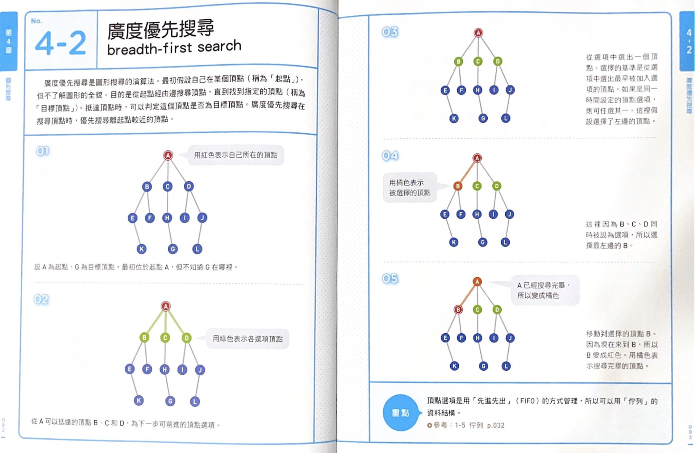
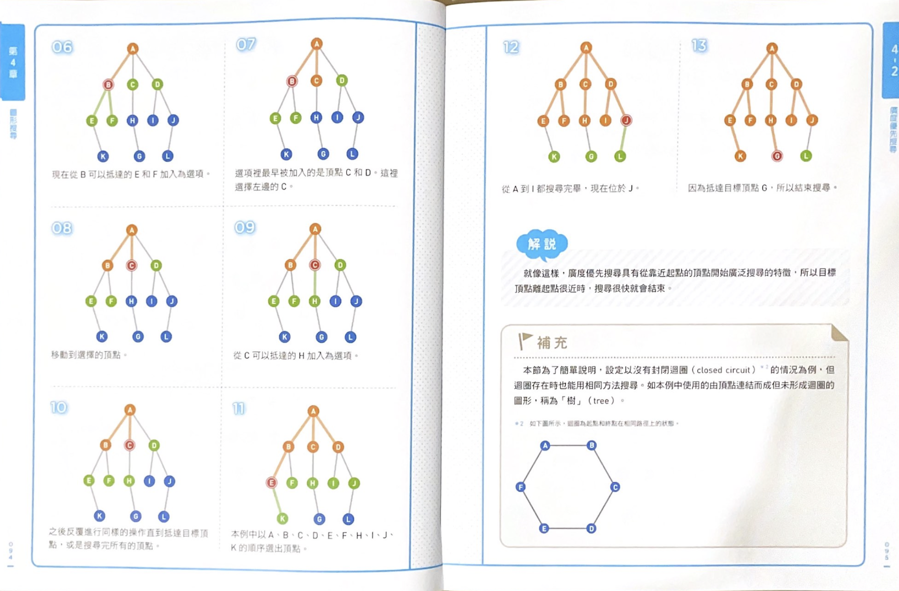
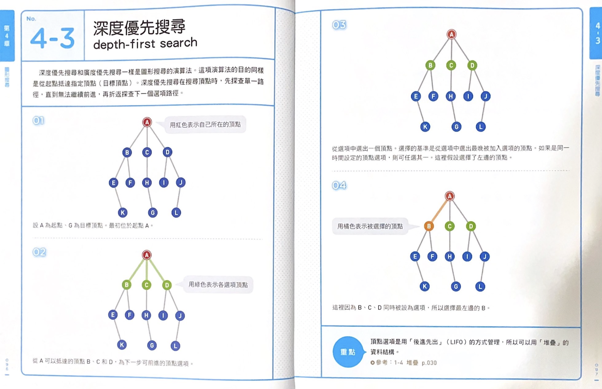
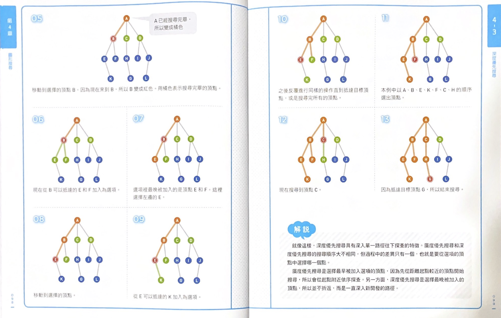

# Chapter 3 堆疊和佇列 Stack and Queue

## 堆疊 Stack

1. 後進先出 (Last In First Out, LIFO)
2. 操作：
    1. pop() : 取出並刪除最頂端的項目
    2. push(item) : 添加一個項目到最頂部
    3. peek() : 回傳最頂部的項目(但不刪除)
    4. isEmpty() : 堆疊為空則回傳 true
3. 不提供對第i個元素的存取。加入和刪除能在常數時間內完成。
4. 簡單實作範例：
    ```java
        public class MyStack<T> {
            private static class StackNode<T> {
                private T data;
                private StackNode<T> next;
                public StackNode(T data) {
                    this.data = data;
                }
            }
        
            private StackNode<T> top; // has data and a StackNode next
   
            public T pop() {
                if (top == null) throw new EmptyStackException();
                T item = top.data;
                top = top.next;
                return item;
            }
        
            public void push(T item) {
                StackNode<T> t = new StackNode<T>(item);
                t.next = top;
                top = t;
            }
        
            public T peek() {
                if (top == null) throw new EmptyStackException();
                return top.data;
            }
        
            public boolean isEmpty() {
                return top == null;
            }
        }
    ```
   延伸閱讀: [分別利用 Array 與 LinkedList 實作 Stack](https://chikuwa-tech-study.blogspot.com/2021/05/java-stack.html)

5. 注意事項：
    1. 經常使用堆疊的時機是：深度優先搜尋(Depth-First Search, DFS)、遞迴。

## 佇列 Queue

1. 先進先出 (First In First Out, FIFO)
2. 操作：
    1. add(item) : 在最尾端添加一個項目
    2. remove() : 刪除第一項
    3. peek() : 回傳最頂部的項目
    4. isEmpty() : 佇列為空則回傳 true

| 操作\行為 |   拋出異常    |  返回特殊值   |
|:-----:|:---------:|:--------:|
|  插入   |  add(e)   | offer(e) |
|  移除   | remove()  |  poll()  |
|  檢查   | element() |  peek()  |

3. 簡單實作範例：
   ```java
    public class MyQueue<T> {
        private static class QueueNode<T> {
            private T data;
            private QueueNode<T> next;
    
            public QueueNode(T data) {
                this.data = data;
            }
        }
        
        private QueueNode<T> first;
        private QueueNode<T> last;
        
        public void add(T item){
            QueueNode<T> t = new QueueNode<T>(item);
            if (last != null) {
                last.next = t;
            }
            last = t;
            if (first != null) {
                first = last;
            }
        }
        
        
        public T remove() {
            if (first == null)  throw new NoSuchElementException();
            T data = first.data;
            first = first.next;
            if (first == null) {
                last = null;
            }
            return data;
        }
        
        public T peek() {
            if (first == null)  throw new NoSuchElementException();
            return first.data;
        }
        
        public boolean isEmpty() {
            return first == null;
        }
    }
   ```

5. 注意事項：
    1. 更新第一個和最後一個節點時常會出錯，要多檢查。
    2. 經常使用佇列的時機是：寬度優先搜尋(Breadth-First Search, BFS)、實作快取。

## Java Collection UML



1. Stack 本質上是一個 List。
2. 因為 Stack 繼承了 Vector， Vector 又實作了 List Interface，所以 List 和 Vector 能用的方法，Stack 都能用。這導致了 Stack 是可以做出超越自己該做的事情。
3. Vector 與 ArrayList 的差異在於 Vector 是 thread-safe。Vector 暴力的在每個方法掛上 `synchronized`
   關鍵字來處理多執行緒議題，導致在單執行緒的環境下，效能輸給 ArrayList，於是現在幾乎沒有人在用。若是有使用 Vector
   的需求，也可以用 `Collections.synchronizedList()`來替代。
4. Queue 的實作有 ArrayQueue 與 LinkedList。

## 堆疊練習題：

### [#150 Evaluate Reverse Polish Notation](https://leetcode.com/problems/evaluate-reverse-polish-notation/)

1. 直覺：

```java
class Solution {
    public int evalRPN(String[] tokens) {
        Stack<String> stack = new Stack<>();

        for (String el : tokens) {
            if (isOperator(el)) {
                String numB = stack.pop();
                String numA = stack.pop();
                stack.push(calculate(numA, el, numB));
            } else {
                stack.push(el);
            }
        }

        return Integer.parseInt(stack.pop());
    }

    private boolean isOperator(String el) {
        return Arrays.asList("+", "-", "*", "/").contains(el);
    }

    private String calculate(String numA, String operator, String numB) {
        switch (operator) {
            case "+":
                return String.valueOf(Integer.parseInt(numA) + Integer.parseInt(numB));
            case "-":
                return String.valueOf(Integer.parseInt(numA) - Integer.parseInt(numB));
            case "*":
                return String.valueOf(Integer.parseInt(numA) * Integer.parseInt(numB));
            case "/":
                return String.valueOf(Integer.parseInt(numA) / Integer.parseInt(numB));
            default:
                return null;
        }
    }
}
```

2. 優化：

```java
class Solution {
    public int evalRPN(String[] tokens) {
        Stack<Integer> stack = new Stack<>();

        for (String t : tokens) {
            switch (t) {
                case "+":
                    stack.push(stack.pop() + stack.pop());
                    break;
                case "-":
                    stack.push(-stack.pop() + stack.pop());
                    break;
                case "*":
                    stack.push(stack.pop() * stack.pop());
                    break;
                case "/":
                    int a = stack.pop(), b = stack.pop();
                    stack.push(b / a);
                    break;
                default:
                    stack.push(Integer.parseInt(t));
                    break;
            }
        }

        return stack.pop();
    }

}
```

## 佇列練習題：

### [#1475 Final Prices With a Special Discount in a Shop](https://leetcode.com/problems/final-prices-with-a-special-discount-in-a-shop/)

1. 直覺：

```java
class Solution {
    public int[] finalPrices(int[] prices) {
        int[] result = new int[prices.length];

        for (int i = 0; i < prices.length; i++) {
            result[i] = prices[i];
            for (int j = i + 1; j < prices.length; j++) {
                if (prices[j] <= prices[i]) {
                    result[i] = prices[i] - prices[j];
                    break;
                }
            }
        }
        return result;
    }
}
```

2. 優化：

```java
class Solution {
    public int[] finalPrices(int[] prices) {
        Stack<Integer> stack = new Stack<>();
        for (int i = 0; i < prices.length; i++) {
            while (!stack.isEmpty() && prices[stack.peek()] >= prices[i])
                prices[stack.pop()] -= prices[i];
            stack.push(i);
        }
        return prices;
    }
}
```

### 補充：

#### Stack


#### Queue


#### BFS



#### DFS

