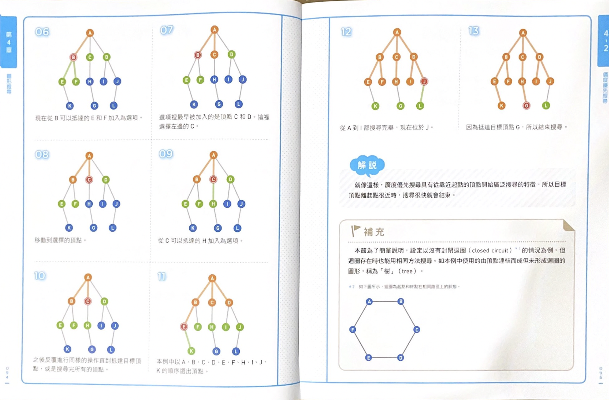

# 圖 Graph


## 圖是什麼？
1. 樹是圖的一種，但不是所有的圖都是樹。樹是沒有循環的圖。
2. 圖可以有向或無向。
3. 每個點之間都連通，稱為連通圖。
4. 沒有循環的圖，稱為無環圖。

## 圖的常見表示方法
### 鄰接表
// TODO
### 鄰接矩陣
// TODO

## 搜尋法(以樹為例，圖只要再加上紀錄已探訪就好)
### 廣度優先搜尋 BFS



### 深度優先搜尋 DFS


## Exercise
### [200. Number of Islands](https://leetcode.com/problems/number-of-islands/)

給你一個由 '1'（陸地）和 '0'（海）組成的的二維網格，請你計算網格中島嶼的數量。

島嶼總是被水包圍，並且每座島嶼只能由水平方向和/或垂直方向上相鄰的陸地連接形成。

此外，你可以假設該網格的四條邊均被水包圍。

#### [解法](https://leetcode.com/problems/number-of-islands/discuss/56359/Very-concise-Java-AC-solution)

1. 巡訪每塊網格
2. 檢查此塊網格是否為陸地
3. 若是陸地，探索鄰近網格
4. 將已探索的網格標記為"海"。（相當於記錄成已探索，因為此題題意恰巧不看海）
5. 繼續探索鄰近網格
6. 若鄰近網格： 1.超出網格給定範圍 或 2.是海，則結束此探索分枝
7. 當所有分枝探索完畢，退回起始網格時，島嶼數量+1
8. 繼續巡訪每塊網格(重複上述步驟)

``` java
class Solution {
    
    char[][] map;
    int height, width;
    
    public int numIslands(char[][] grid) {
        map = grid;
        height = map.length; 
        width = map[0].length;
        
        int islandCount = 0;
        
        // guard clause: if no grid, no island
        if (height == 0) return 0;
        
        // iterate(nested loop) through the whole grid
        for (int y = 0; y < height; y++) {
            for (int x = 0; x < width; x++) {
                // 1. if it is a lsland, check adjacent grids
                if (map[y][x] == '1') { 
                    
                    // 2. DFS through all adjacent grids until no island grid
                    discoverAdjacentGrid(y, x);
                    
                    // 3. now all island grid are marked as 0 and we can add 1 to island count
                    islandCount++; 
                }
            }
        }

        return islandCount;
    }
    
    private void discoverAdjacentGrid(int y, int x) {
        // validate
        if (y < 0 || y >= height || x < 0 || x >= width || map[y][x] != '1') return; // end condition
        
        // marked this as visited ('1' -> '0')
        map[y][x] = '0';
        
        // check adjacent grids
        discoverAdjacentGrid(y+1, x); // down
        discoverAdjacentGrid(y-1, x); // up
        discoverAdjacentGrid(y, x+1); // right
        discoverAdjacentGrid(y, x-1); // left
    }
    
}
```

### [547.Number of Provinces](https://leetcode.com/problems/number-of-provinces/description/)

有 n 個城市，其中一些彼此相連，另一些沒有相連。

如果城市 a 與城市 b 直接相連，且城市 b 與城市 c 直接相連，那麼城市 a 與城市 c 間接相連。

省份 是一組直接或間接相連的城市，組內不含其他沒有相連的城市。

給你一個 n x n 的矩陣 isConnected ，其中 isConnected[ i ] [ j ] = 1 表示第 i 個城市和第 j 個城市直接相連，

而 isConnected[ i ][ j ] = 0 表示二者不直接相連。

返回矩陣中 省份 的數量。

#### [解法](https://leetcode.com/problems/number-of-provinces/solutions/342640/java-solution/)

1. isConnected 二維陣列就是鄰接矩陣
2. 尋訪第一層陣列，意義是看見此點所連接的其他點
3. 探索連接的點。 DFS: 把其他點當成當前的點，再往下探索。記得紀錄走過的點。
4. 一條路線探索完畢之後，相當於找出一個解。
5. 回傳解答的數量。

``` java
class Solution {
    int[][] c;
    boolean[] visited;
    int provinces = 0;

    public int findCircleNum(int[][] isConnected) {
      c = isConnected;
      visited = new boolean[c.length];

      for (int i = 0 ; i < c.length; i++) {
        if (!visited[i]) {
            dfs(i);
            provinces++;
        }
      }

      return provinces;
    }

    private void dfs(int i) {
       for (int j = 0; j < c[i].length; j++) {
           if (!visited[j] && c[i][j] == 1) {
               visited[j] = true;
               dfs(j);
           }
       }
    }

}
```

### [841. Keys and Rooms](https://leetcode.com/problems/keys-and-rooms/description/)

有 n 個房間，房間按從 0 到 n - 1 編號。

最初，除 0 號房間外的其餘所有房間都被鎖住。你的目標是進入所有的房間。

然而，你不能在沒有獲得鑰匙的時候進入鎖住的房間。

當你進入一個房間，你可能會在裡面找到一套不同的鑰匙，

每把鑰匙上都有對應的房間號，即表示鑰匙可以打開的房間。

你可以拿上所有鑰匙去解鎖其他房間。

給你一個數組 rooms 其中 rooms[i] 是你進入 i 號房間可以獲得的鑰匙集合。

如果能進入 所有 房間返回 true，否則返回 false。

#### [解法](https://leetcode.com/problems/keys-and-rooms/solutions/1116707/js-python-java-c-easy-dfs-stack-solution-w-explanation/)

1. 用 Stack 紀錄擁有的鑰匙
2. 拿取這些鑰匙去開房間
3. DFS: 如果房間沒有被開過，打開並記錄已經打開過，同時開過的房間數+1
4. 最後，確認開過的房間數量是否與所有房間數量一致

``` java
class Solution {
    public boolean canVisitAllRooms(List<List<Integer>> rooms) {
        boolean[] visited = new boolean[rooms.size()];
        visited[0] = true;

        Stack<Integer> stack = new Stack<>();
        stack.push(0);

        int visitedRooms = 1;

        while(!stack.empty()) {
            List<Integer> keysOfRooms = rooms.get(stack.pop());
            for (int room : keysOfRooms) {
                if(!visited[room]) {
                    visited[room] = true;
                    visitedRooms++;
                    stack.push(room);
                }
            }
        }

        return rooms.size() == visitedRooms;
    }

}
```