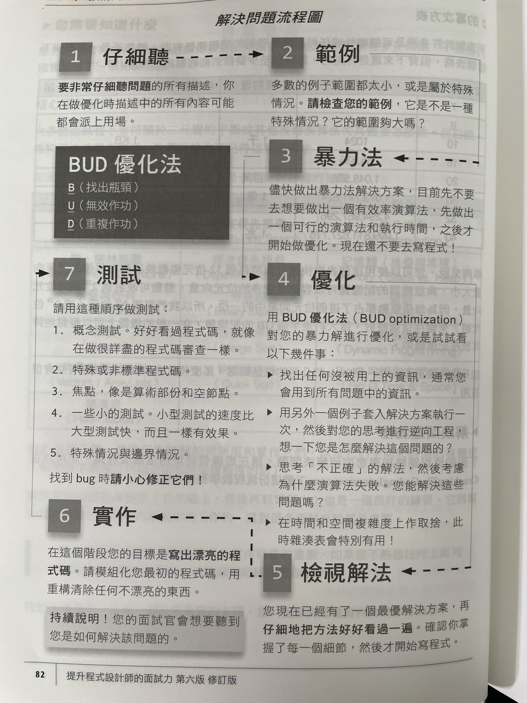

# VII 技術問題

## 如何準備
1. 自己解決問題：一定要考慮時間和空間效率
2. 把程式碼寫在紙上：IDE是奢侈品，而有時候面試不會給你用
3. 在紙上測試您的程式碼：同上
4. 把紙上的程式碼輸入電腦：檢查答案，並檢討錯誤
5. 多做模擬面試

## 需要知道的知識
1. 核心資料結構、演算法和概念

|                 資料結構                 |                   演算法                    |                     概念                      |
|:------------------------------------:|:----------------------------------------:|:-------------------------------------------:|
|      連結串列<br/>( Linked Lists )       | 廣度優先搜尋<br/>( BFS, Breadth-First Search ) |        位元操作<br/>( Bit Manipulation )        |
| 樹、樹林與圖<br/>( Trees,Tries & Graphs )  |  深度優先搜尋<br/>( DFS, Depth-First Search )  | 記憶體(堆疊與堆積)<br/>( Memory( Stack vs. Heap ) ) |
|    堆疊與佇列<br/>( Stacks & Queues )     |       二分法搜尋<br/>( Binary Search )        |            遞迴<br/>( Recursion )             |
|           堆積<br/>( Heaps )           |         合併排序法<br/>( Merge Sort )         |      動態規劃<br/>( Dynamic Programming )       |
| 向量與陣列串列<br/>( Vectors / ArrayLists ) |         快速排序法<br/>( Quick Sort )         |  Big O 時間與空間複雜度<br/>( Big O Time & Space)   |
|       雜湊表<br/>( Hash Tables )        |                                          |                                             |

2. 2的冪次方表

| 2的冪次方 |     正確值 ( X )     | 概約值 | 以 MB、GB 等表示的 X 個位元組 |
|:-----:|:-----------------:|:---:|:-------------------:|
|   7   |        128        |     |                     |
|   8   |        256        |     |                     |
|  10   |       1024        | 1千  |        1 KB         |
|  16   |      65,536       |     |        64 KB        |
|  20   |     1,048,576     | 1百萬 |        1 MB         |
|  30   |   1,073,741,824   | 1億  |        1 GB         |
|  32   |   4,294,967,296   |     |        4 GB         |
|  40   | 1,099,511,627,776 | 1兆  |        1 TB         |

3. 解決問題流程

4. 心理準備
   1. 仔細聽：注意題目的前提或條件，都可能會用上
   2. 舉個例子：舉一個具體且量體夠大的例子幫助思考
   3. 做出暴力解
   4. 優化：
      1. 回到第一點，你是否還有些資訊沒有用上呢？
      2. 舉一個不同的例子
      3. 「不正確地」解決問題，吐槽的過程容易激盪出聰明的想法
      4. 複雜度取捨
      5. 預先處理
      6. 雜湊表
      7. 思考最佳的可想像執行時間
5. 檢視解法：演算法與結構、變數的設計
6. 實作：由大至小
   1. 請適當包裹細節，並告訴面試官，如果需要的話，稍後再提供細節
   2. 錯誤檢查：可以先留下 todo，表明自己稍後會回來補上
7. 測試
   1. 檢查邏輯概念
   2. 從不一般的地方看起： x = length -2 或 i = 1 開始的那些迴圈
   3. 熱點：容易出錯的地方
   4. 小測試
   5. 特殊情況
8. 優化與解決技巧：
   1. 找出BUD
      1. ***B***ottlenecks ( 瓶頸 )：
         1. 時間複雜度最高的工作
         2. 大量重複的工作
      2. ***U***nneccessary work ( 不必要的工作 )：數學或邏輯上
      3. ***D***uplicated work ( 重複的工作 )：數學或邏輯上
      ```java
      // Prime factorization
      for (i = 0; i <= Math.sqrt(n); i++) {
      }
      ```
   2. 動手做：有時候把你人工的做法轉成程式碼，會比直接想程式碼運作得更好
   3. 簡化與泛型化
   4. 基礎條件和建立：遞迴
   5. 資料結構腦力激盪
9. 最佳可想像執行時間 ( BCR, Best Conceivable Runtime )：
   1. 你能想到的最佳執行時間，不一定可實作，只代表無法打敗。
   2. 請讀一下這個小章節，很有啟發。
10. 好的程式碼：
    1. 正確
    2. 效率
    3. 簡單：更少行數但不晦澀難懂的程式碼
    4. 可讀：以後要來讀的人，八成就是你自己
    5. 可維護性：以後要來維護的人，八成就是你自己
    6. 使用資料結構特性，沒有適合的，就設計自己的
    7. DRY